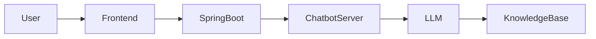
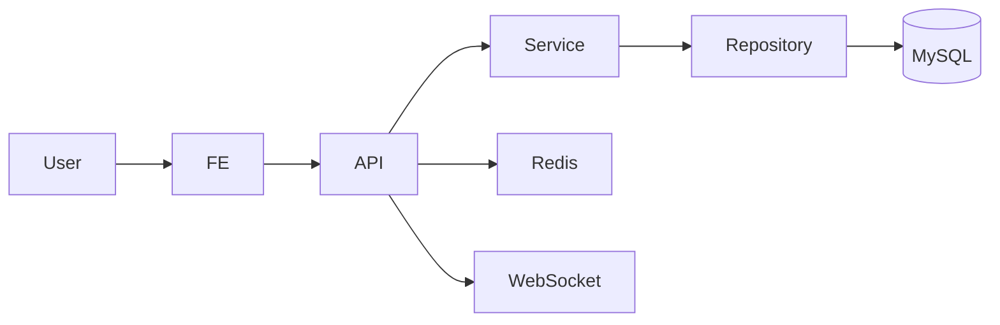

# CC Backend

Campus Connect의 백엔드 서버입니다.\
Spring Boot 기반 커뮤니티 서비스이며 **LLM 기반 챗봇 기능**을
제공합니다.

사용자 인증, 게시글 기능, 실시간 기능(WebSocket), 챗봇 서빙 연동을
담당합니다.

------------------------------------------------------------------------

# 프로젝트 소개

  항목            내용
  --------------- -------------------------------
  프로젝트 이름   Campus Connect Backend
  개발 인원       Backend 1
  핵심 기술       Spring Boot, Redis, WebSocket
  주요 기능       커뮤니티 + 챗봇 상담

Campus Connect는 사용자 간 커뮤니티 활동과\
챗봇 기반 상담 기능을 제공하는 서비스입니다.

Spring Boot 서버는\
**서비스 API와 챗봇 서버 사이에서 Gateway 역할**을 수행합니다.

------------------------------------------------------------------------

# 서비스 화면

```{=html}
<p align="center">
```
``{=html}
``{=html}
``{=html}
```{=html}
</p>
```

------------------------------------------------------------------------

# 챗봇 시스템 아키텍처



Campus Connect에서는 사용자 문의를 빠르게 처리하기 위해\
**LLM 기반 챗봇 상담 기능**을 제공합니다.

챗봇 모델은 **Python 서버**에서 실행되며\
Spring Boot 서버는 **API Gateway 역할**을 수행합니다.

------------------------------------------------------------------------

# 챗봇 서빙 흐름

1️⃣ 사용자가 질문 입력\
2️⃣ 프론트엔드 → Spring Boot API 요청\
3️⃣ Spring Boot → 챗봇 서버 호출\
4️⃣ 챗봇 서버에서 LLM 기반 응답 생성\
5️⃣ 응답 결과를 사용자에게 전달

### 설계 포인트

-   **AI 서버와 서비스 서버 분리**
-   **확장 가능한 챗봇 구조**
-   **API Gateway 패턴 적용**

------------------------------------------------------------------------

# 기술 스택

### Backend

-   Java 17
-   Spring Boot
-   Spring Data JPA
-   Spring Security
-   WebSocket / STOMP
-   Redis

### AI / Chatbot

-   Python
-   FastAPI
-   LLM 기반 응답 생성

### Database

-   MySQL

### Infra

-   AWS EC2
-   AWS RDS

### Tools

-   Swagger (springdoc-openapi)
-   log4jdbc
-   Logback

------------------------------------------------------------------------

# 시스템 아키텍처



------------------------------------------------------------------------

# 프로젝트 구조

    src/main/java/com/example/cc
    ├── config
    │   ├── security
    │   ├── websocket
    │   └── redis
    ├── controller
    ├── service
    ├── repository
    ├── entity
    ├── dto
    └── CcApplication.java

------------------------------------------------------------------------

# 실행 방법

### 요구사항

-   JDK 17
-   MySQL
-   Redis

### 실행

``` bash
./gradlew clean build
./gradlew bootRun
```

------------------------------------------------------------------------

# 환경 변수

    DB_URL=
    DB_USERNAME=
    DB_PASSWORD=

    REDIS_HOST=
    REDIS_PORT=

    JWT_SECRET=

    CHATBOT_SERVER_URL=

------------------------------------------------------------------------

# 트러블슈팅 / 개선 포인트

-   Spring Security 인증 흐름 정리
-   WebSocket 기반 실시간 기능 구현
-   Redis 캐싱을 통한 응답 성능 개선
-   챗봇 서버와 백엔드 서버 분리를 통한 확장성 확보
