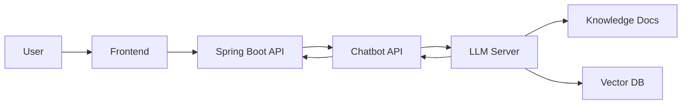
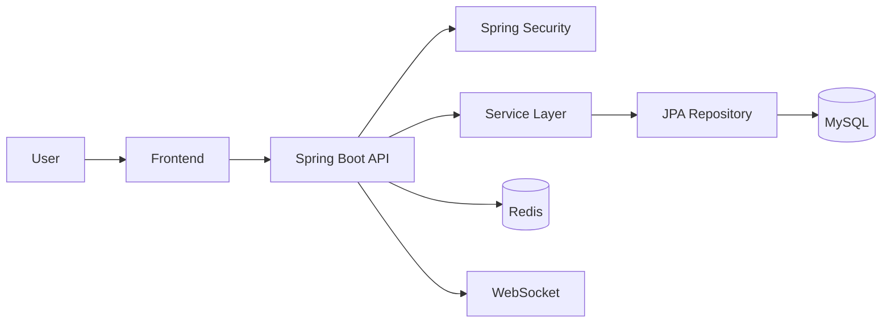

# CC_BACKEND

Campus Connect 서비스의 백엔드 API 서버입니다.\
사용자 인증, 커뮤니티 게시글, 실시간 기능(WebSocket), 챗봇 서빙 연동
등을 처리하는\
Spring Boot 기반 백엔드 서버입니다.

------------------------------------------------------------------------

## 목차

-   프로젝트 소개
-   주요 기능
-   서비스 화면
-   챗봇 시스템 아키텍처
-   챗봇 서빙 흐름
-   기술 스택
-   시스템 아키텍처
-   프로젝트 구조
-   데이터베이스 설계
-   API 도메인
-   실행 방법
-   환경 변수
-   트러블슈팅 / 개선 포인트

------------------------------------------------------------------------

## 프로젝트 소개

  항목            내용
  --------------- ---------------------------------------------
  프로젝트 이름   Campus Connect Backend
  역할            Backend 개발
  개발 인원       Backend 1
  핵심 스택       Java 17, Spring Boot, JPA, Redis, WebSocket

Campus Connect는 사용자 간 커뮤니티 활동과 실시간 소통을 지원하는\
**Spring Boot 기반 커뮤니티 서비스 백엔드**입니다.

게시글 기반 커뮤니티 기능과 함께\
**WebSocket 기반 실시간 통신**, **Spring Security 인증**, **Redis
캐시**,\
**챗봇 서버 연동** 등을 적용하여 확장성과 유지보수성을 고려한 백엔드
아키텍처를 설계했습니다.

------------------------------------------------------------------------

## 주요 기능

-   사용자 인증 / 권한 관리
-   커뮤니티 게시글 CRUD
-   WebSocket 기반 실시간 기능
-   Redis 기반 데이터 처리
-   챗봇 서빙 서버 연동
-   Swagger 기반 API 문서 제공

------------------------------------------------------------------------

## 서비스 화면

### 메인 화면

```{=html}
<p align="center">
```
``{=html}
``{=html}
``{=html}
```{=html}
</p>
```
### 게시글 화면

```{=html}
<p align="center">
```
``{=html}
```{=html}
</p>
```

------------------------------------------------------------------------

## 챗봇 시스템 아키텍처

```{=html}
<p align="center">
```
``{=html}
```{=html}
</p>
```
Campus Connect에서는 사용자 문의를 빠르게 처리하기 위해\
LLM 기반 챗봇을 활용한 상담 기능을 제공합니다.

챗봇 모델은 Python 서버에서 실행되며\
Spring Boot 서버는 **API Gateway 역할**을 수행합니다.

------------------------------------------------------------------------

## 챗봇 서빙 흐름



### 처리 과정

1.  사용자가 질문을 입력합니다.
2.  프론트엔드 → Spring Boot API 요청
3.  Spring Boot 서버 → 챗봇 서버 호출
4.  챗봇 서버가 LLM 기반으로 응답 생성
5.  응답 결과를 사용자에게 전달

### 설계 포인트

-   **서비스 서버와 AI 서버 분리**
-   **API Gateway 역할 수행**
-   **AI 서버 확장 가능 구조 설계**

------------------------------------------------------------------------

## 기술 스택

### Backend

-   Java 17
-   Spring Boot
-   Spring Data JPA
-   Spring Security
-   WebSocket / STOMP
-   Redis

### AI / Chatbot

-   Python
-   FastAPI
-   LLM 기반 응답 생성

### Database

-   MySQL

### Infra / DevOps

-   AWS (EC2, RDS)

### Tools

-   Swagger (springdoc-openapi)
-   log4jdbc
-   Logback

------------------------------------------------------------------------

## 시스템 아키텍처



------------------------------------------------------------------------

## 프로젝트 구조

``` text
src/main/java/com/example/cc
├── config
│   ├── security
│   ├── websocket
│   └── redis
├── controller
├── service
├── repository
├── entity
├── dto
└── CcApplication.java

src/main/resources
├── application.properties
├── logback.xml
└── static
```

### 계층 설명

  계층         역할
  ------------ -----------------------------------
  Controller   API 요청 및 응답 처리
  Service      비즈니스 로직 처리
  Repository   데이터베이스 접근
  Entity       데이터베이스 테이블 매핑
  DTO          요청 및 응답 데이터 모델
  Config       Security / Redis / WebSocket 설정

------------------------------------------------------------------------

## 데이터베이스 설계

### 핵심 엔터티

-   users (사용자)
-   posts (게시글)
-   comments (댓글)
-   notifications (알림)

### ERD


------------------------------------------------------------------------

## API 도메인

-   Auth : 회원가입 / 로그인 / 인증
-   User : 사용자 정보
-   Post : 게시글 CRUD
-   Comment : 댓글 관리
-   Notification : 알림
-   Realtime : WebSocket 실시간 기능
-   Chatbot : 챗봇 질의응답

------------------------------------------------------------------------

## 실행 방법

### 요구사항

-   JDK 17
-   MySQL
-   Redis

### 실행

``` bash
./gradlew clean build
./gradlew bootRun
```

------------------------------------------------------------------------

## 환경 변수

``` bash
DB_URL=
DB_USERNAME=
DB_PASSWORD=

REDIS_HOST=
REDIS_PORT=

JWT_SECRET=

CHATBOT_SERVER_URL=
```

------------------------------------------------------------------------

## 트러블슈팅 / 개선 포인트

-   Spring Security 인증 흐름 정리
-   WebSocket 기반 실시간 기능 구현
-   Redis 캐싱 적용으로 응답 성능 개선
-   챗봇 서버와 백엔드 서버 분리로 확장성 확보
